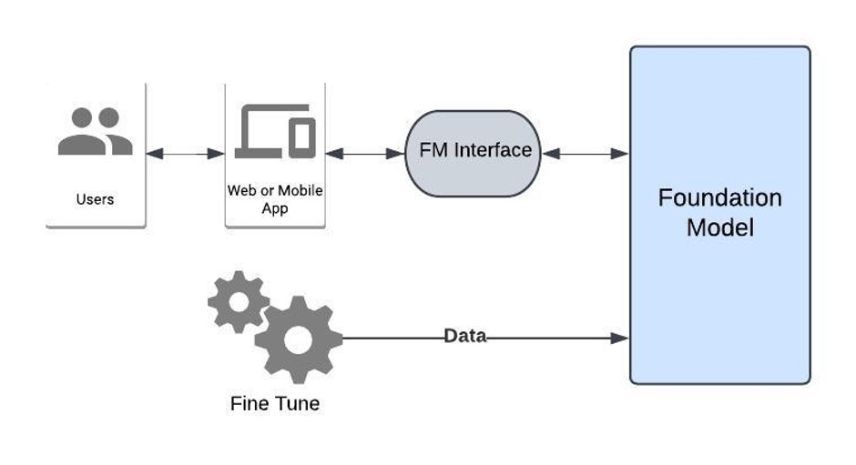
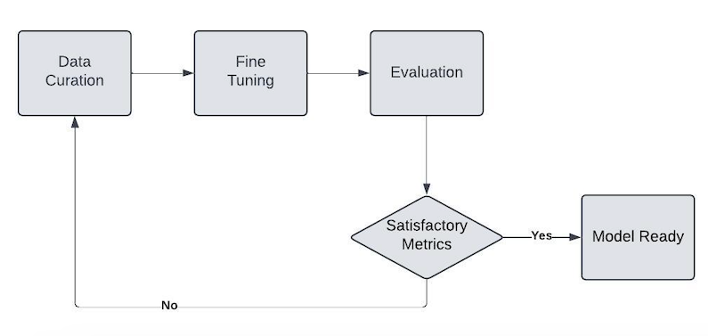
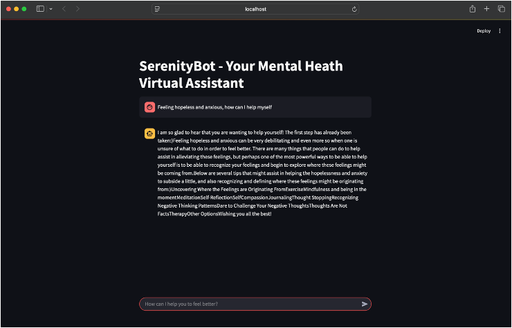

# SerenityBot - Your Mental Health Virtual Assistant

Mental health disorders are growing at an unprecedented rate and have become a global issue impacting the lives of millions of people and their loved ones. Mental health is a state of well-being that provides us the ability to cope up with stress, learn, realize, work and contribute to community.  Sound mental health is equally important as good physical health and improves overall health of an individual. As per CDC “Nearly one in 4 U.S. adults (58.7 million people) live with a mental health condition” (2024). 

People with mental health disorders suffer from being sad, feeling suicidal, depressed, extreme anxiety, isolation from friends and family, delusional, low energy and sleeplessness. Mental health patients or who are at risk of mental health problems needs timely help and assistance. Traditionally available mental health services can be inaccessible, expensive, and stigmatized, hindering individuals from seeking timely help.  A Mental Health Virtual Assistant (MVHA) will be a great tool to provide mental health support to user 24/7. This tool may be a gamechanger for individuals who do not have access to mental health support as well as when traditional support medium is not available like holidays and off business hours.

This project demonstrates a Mental Health Virtual Assistant (named SerenityBot) utilizing the power of Generative AI. The MHVA will provide guidance, information, emotional and empathetic support to individuals experiencing mental health challenges.

### Approach

The MHVA application will be comprised of four major components: Foundation Model (FM), FM Interface, Fine Tuning and user interaction Console App task.
Users will enter mental health support questions in form of text using the web application. The application will interact with the Fine-tuned Model hosted by model provider via FM interface. Fine tuning will enable much higher quality task specific responses from the foundation model which will be relevant to the mental health questions.  Responses will be finally presented back to the user via the web application. 

### Fine-Tuning

In order to check whether pretrained embedding or own word embedding is better for the task, a simple Sequential Neural network model was trained and evaluated two times – first with own word embedding and then with pretrained GloVe. The comparison of accuracy and loss metrics between GloVe embedding and own embedding shows that, the own embedding is performing better with higher accuracy and lower loss (Figure 4). The Sequential NN using own embedding scored 84% accuracy, while using GloVe it scored only 66.5% when evaluated against the test set.

### Results

The responses from the SerenityBot for mental health questions are very promising. The application is suggesting remediation strategies and helpful steps to support mental health situations whenever it is reasonable to do so. However, the fine-tuning results showed that there is some level of overfitting in the fine-tuned model which can be addressed by increasing the number of training examples covering multiple scenarios. Overall, the SerenityBot is satisfactorily able to answer mental health question with some scope for improvement in future.

### References

CDC. (2024, August 8). _About Mental Health._  **https://www.cdc.gov/mental-health/about/index.html**

Open AI (2024, July 18). _Hello GPT-4o._ **https://openai.com/index/hello-gpt-4o/**

